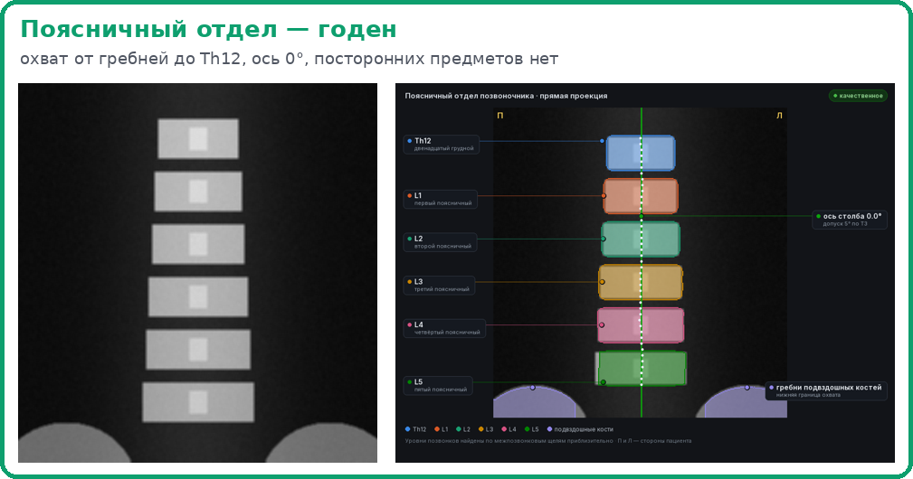
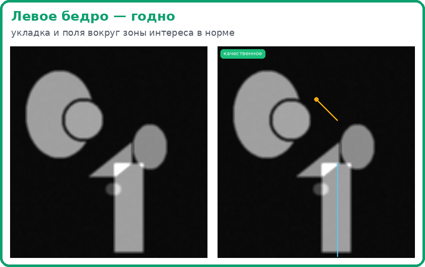
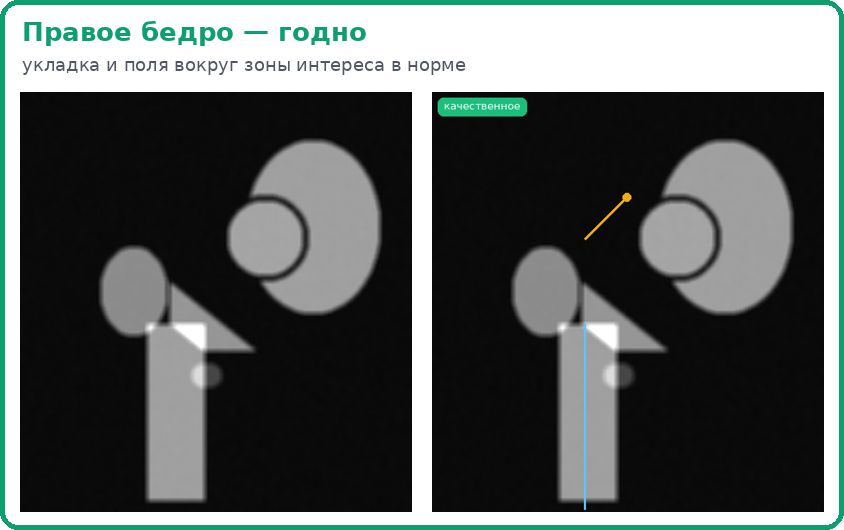
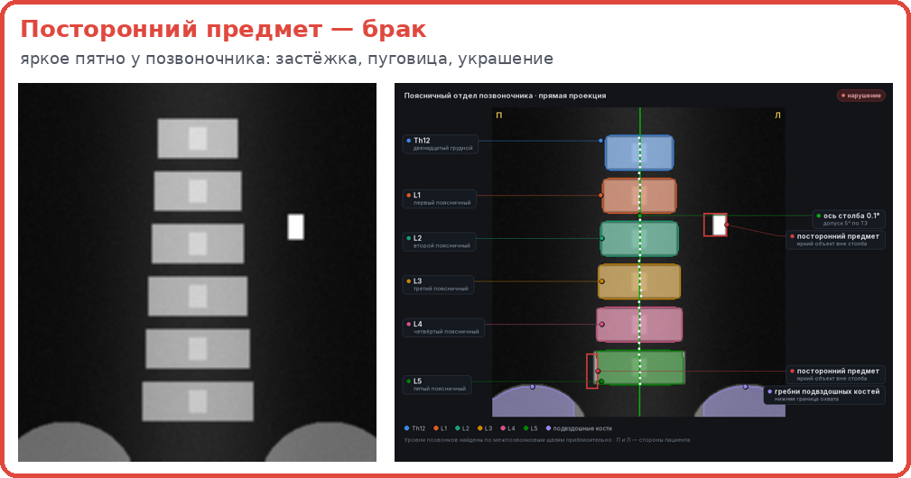
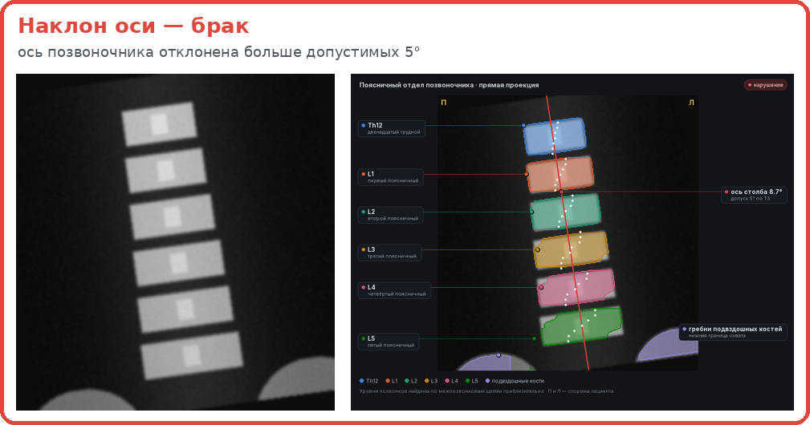
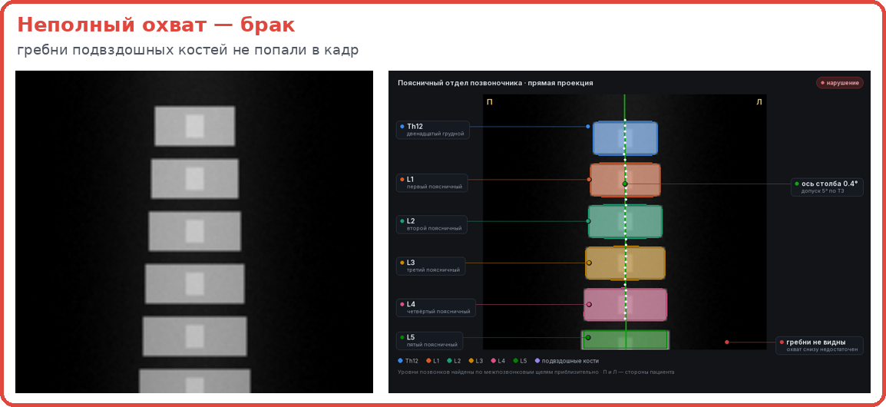

# Kostik — примеры снимков

Все примеры — **синтетические фантомы**: снимки пациентов в документации не публикуются. Каждый пример прогнан
через Kostik: слева исходный снимок, справа — атлас, который построил сервис. Эти же файлы можно загрузить на
стенд и повторить результат (архив собирается скриптом из репозитория, генератор — `dxaqc/desktop/synth.py`).

## Хороший снимок — как выглядит

Требования ТЗ к снимку поясничного отдела:

- в кадре — позвонки от **Th12** до **L5** и **гребни подвздошных костей** в нижних углах;
- ось позвоночника отклонена **не больше 5°**;
- в зоне исследования **нет посторонних предметов** (металл, пуговицы, застёжки, украшения).

Требования к снимку бедра: видны большой вертел, шейка и седалищная кость; ротация бедра правильная (малый вертел
почти не виден); вокруг зоны интереса есть поля — 3 см сверху и снизу, 2 см по бокам.

## Снимки с нарушениями

### Посторонний предмет

Яркое пятно рядом с позвоночником — металлическая застёжка. Такой предмет искажает минеральную плотность кости.
Сервис обводит его рамкой и пишет измерение: контраст пятна против нормы 55.

### Наклон оси

Пациент лёг с поворотом: ось позвоночника отклонена на 8,7° при допуске 5°. Сервис рисует ось на атласе и выносит
угол на выноску.

### Неполный охват

Кадр обрезан снизу: гребни подвздошных костей не попали в снимок, выноска «гребни не видны». Плотность L4–L5 в
таком исследовании оценить нельзя.

## Что сервис делает с чужими файлами

JPG, КТ, МРТ и другие не-DXA файлы не проверяются, но получают понятное объяснение — пример на шаге 9
[пути пользователя](USER_GUIDE.md).
