# Kostik — руководство пользователя

Kostik проверяет качество снимков денситометрии (DXA) поясничного отдела и проксимального отдела бедра по
критериям ТЗ задачи 04. Сервис **не ставит диагноз и не измеряет плотность кости**: он отвечает на вопрос,
годится ли снимок для измерения или его лучше переснять.

Работать можно тремя способами — все дают одинаковый результат:

| способ | для кого | как |
|---|---|---|
| веб-интерфейс | врач, рентгенолаборант | браузер → `http://<сервер>:8000/` (или стенд https://ltz2026.ru) |
| пакетная обработка | эксперт, администратор | `./run.sh <папка или архив.zip> <выход>` — см. [DEPLOY.md](DEPLOY.md) |
| приложение для компьютера | один врач без сервера | Windows `.exe`/`.msi`, Linux `.deb` — https://ltz2026.ru/download |

## Путь пользователя — по шагам

Настоящие скриншоты стенда https://ltz2026.ru/ на синтетических фантомах (примеры —
в [EXAMPLES.md](EXAMPLES.md)).

**1. Главная.** Одна рамка: перетащите DICOM, папку или zip. Ниже — готовые примеры и приложение для компьютера.

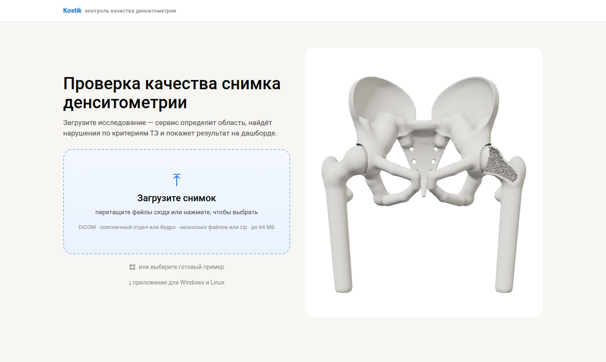

**2. Загрузка.** Полоса показывает, сколько отправлено; дальше сервис сам распакует архив и проверит снимки.

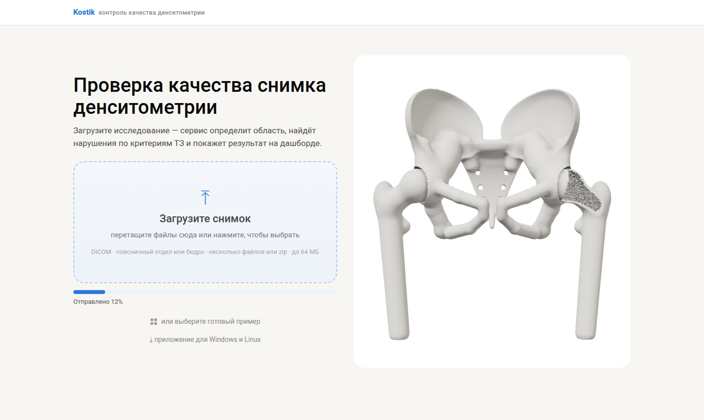

**3. Дашборд проверки.** Сводка: 4 исследования, 6 снимков — 3 качественных, 3 с нарушениями; нарушения по типам
и по областям; галерея снимков с красными и зелёными рамками.

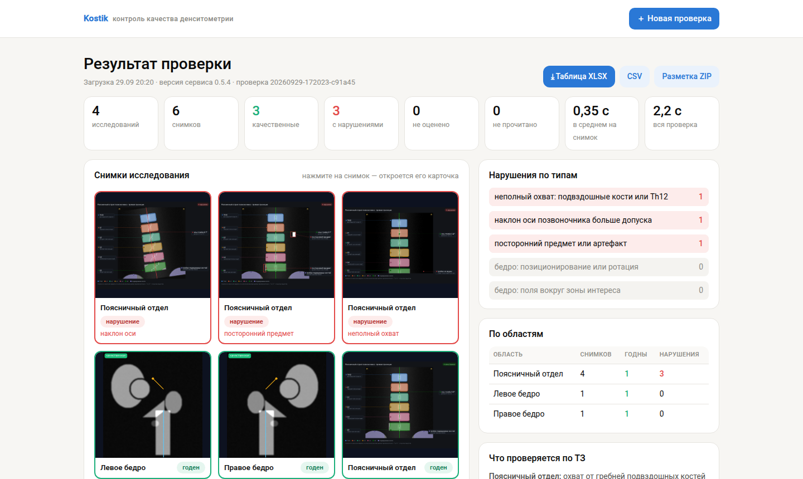

**4. Карточка снимка.** Атлас с разметкой, проверки по критериям ТЗ (✓ / ✕), измерения.

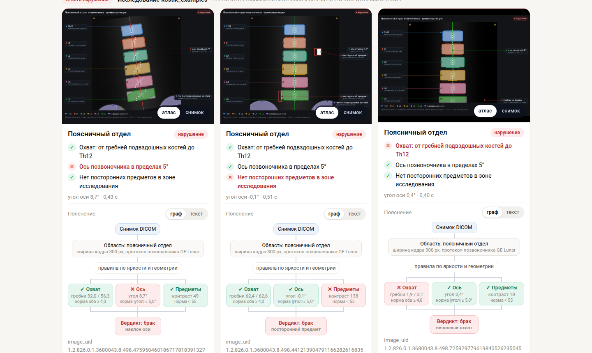

**5. Чистый снимок.** Переключатель «атлас | снимок» показывает исходный рентген без разметки.

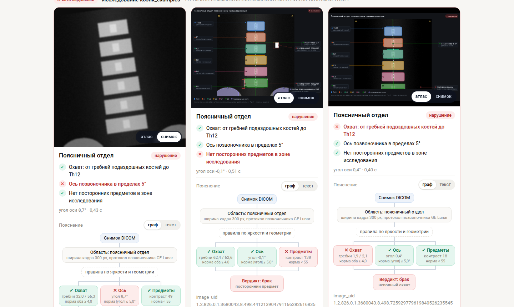

**6. Граф решения.** Каждая проверка — измерение против нормы, внизу вердикт.

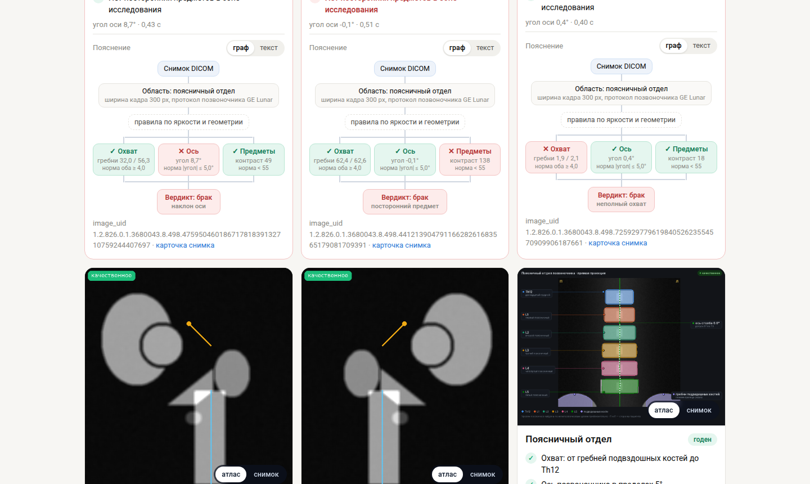

**7. Пояснение текстом.** Тот же вывод словами.

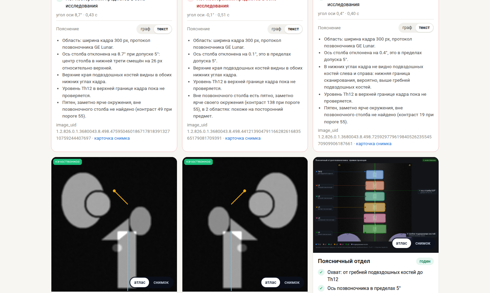

**8. Таблица по п. 2.5 ТЗ.** Строка на снимок; кнопки «Таблица XLSX», «CSV», «Разметка ZIP» — вверху страницы.

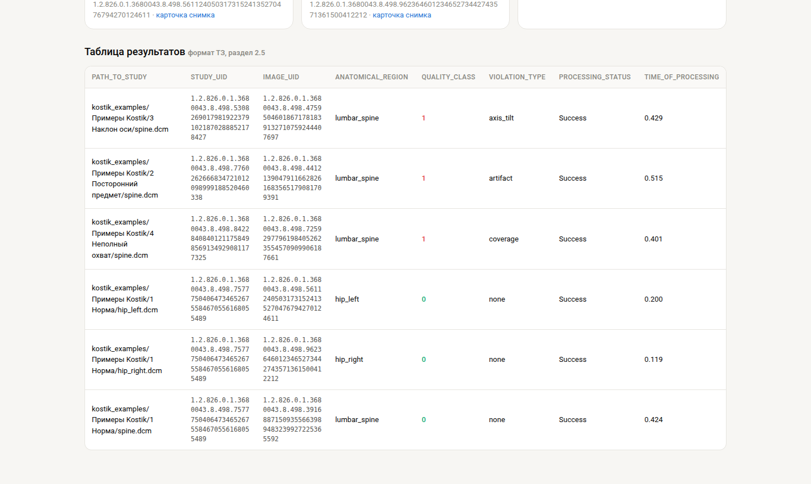

**9. Если файл не тот.** Сервис объясняет, что загружено (здесь — «КТ позвоночника, вид сбоку»), какие надписи на
картинке и что делать.

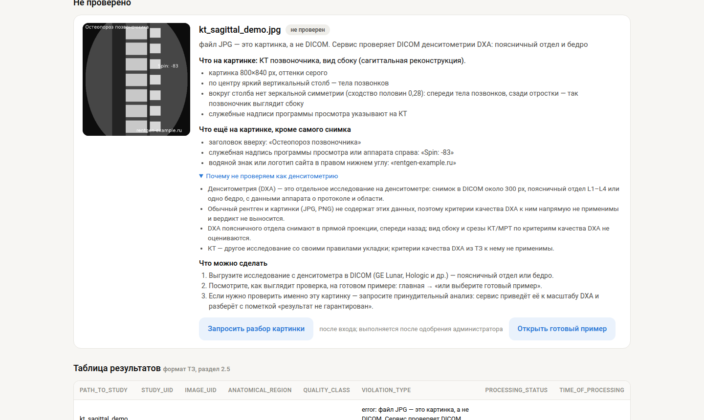

**10. Пульт анализа.** Очередь проверок, пороги критериев, перезапуск с другими параметрами.

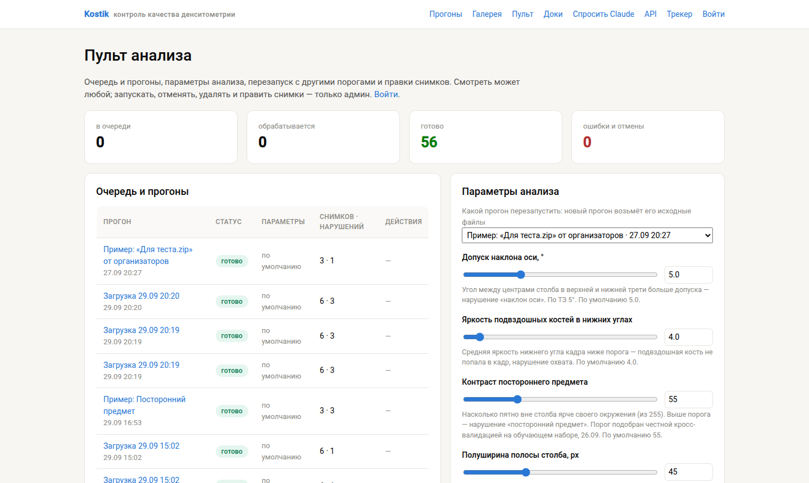

**11. Дообучение на правках врачей.** Плагины, число правок, активные версии, кнопки для администратора.

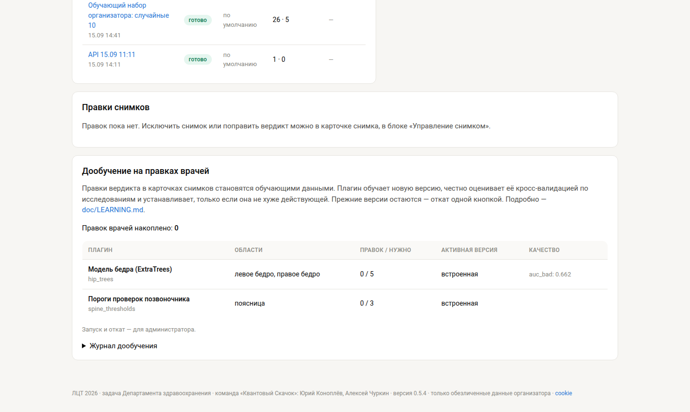

**12. Приложение для компьютера.** Установщики для Windows и Linux, контрольные суммы и подпись.

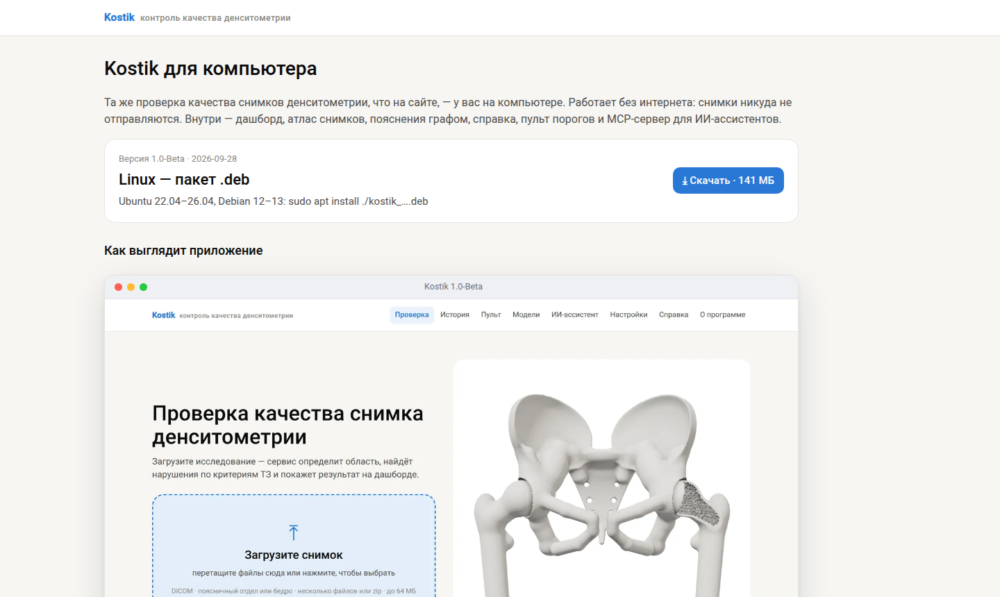

## 1. Проверка в веб-интерфейсе

1. Откройте главную страницу и перетащите в рамку DICOM-файлы, папку или zip-архив (до 64 МБ за раз).
   Нет своих снимков — нажмите **«или выберите готовый пример»**.
2. Через несколько секунд откроется **дашборд проверки**:
   - сверху — сколько исследований и снимков, сколько годных, с нарушениями, не оценено, не прочитано, время;
   - **«Снимки исследования»** — галерея: красная рамка — нарушение, зелёная — годен, серая — не оценено;
     под снимком с нарушением — его причина;
   - **«Нарушения по типам»** и **«По областям»** — где и что чаще всего не так;
   - **«Что проверяется по ТЗ»** — критерии.
3. Нажмите на снимок — откроется его **карточка**:
   - переключатель **«атлас | снимок»** — разметка (позвонки Th12–L5, ось, гребни подвздошных костей, найденные
     предметы) или чистый рентгеновский снимок; общий переключатель для всех снимков — справа от заголовка «Снимки»;
   - список проверок по критериям ТЗ (✓ выполнено, ✕ нарушено);
   - сравнение с экспертами, если для снимка есть экспертная оценка;
   - **пояснение**: граф решения «измерение против нормы → вердикт» или то же текстом.
4. Выгрузите результаты кнопками вверху: **Таблица XLSX**, **CSV** (формат п. 2.5 ТЗ), **Разметка ZIP** (атласы).

## 2. Как читать вердикт

| колонка таблицы | значения |
|---|---|
| `anatomical_region` | `lumbar_spine` — поясничный отдел; `hip_left`, `hip_right` — левое и правое бедро; `unknown` — файл не прочитан |
| `quality_class` | `0` — качественный, `1` — есть нарушение, пусто — не оценено или файл не прочитан |
| `violation_type` | коды через `;`, `none` — нарушений нет, `error: <причина>` — файл не обработан |
| `processing_status` | `Success` или `Failure` |
| `time_of_processing` | секунды на снимок |

Коды нарушений:

| код | область | критерий ТЗ | как проверяется |
|---|---|---|---|
| `coverage` | поясница | охват от гребней подвздошных костей до Th12 | яркость подвздошных костей в нижних углах кадра |
| `axis_tilt` | поясница | отклонение оси не больше 5° | угол хорды осевой линии столба между верхней и нижней третью |
| `artifact` | поясница | нет посторонних предметов | пятно вне столба заметно ярче своего окружения |
| `hip_positioning` | бедро | укладка и ротация по малому вертелу | модель ExtraTrees по 47 признакам формы |
| `hip_roi` | бедро | поля вокруг зоны интереса | та же модель |

Если нарушений несколько, `quality_class = 1`, а `violation_type` перечисляет все коды.

**Точность.** По позвоночнику вердикт надёжнее (ROC-AUC 0,75, посторонние предметы 0,85, охват 0,88), по бедру —
подсказка для проверки глазами (ROC-AUC 0,66). Подробнее — README, раздел «Честное состояние».

**Когда стоит посмотреть самому:**
- «посторонний предмет? или ребро — проверьте» — два симметричных пятна вверху кадра: это может быть и бюстгальтер,
  и нижние рёбра;
- наклон оси при сколиозе: изгиб позвоночника сервис может принять за неправильную укладку;
- «результат ориентировочный» — снимок вырезан из отчёта денситометра или проверен принудительно.

## 3. Если файл не принят

Каждый непринятый файл получает строку `Failure` и понятную причину, остальные файлы проверяются дальше:

| причина | что делать |
|---|---|
| «это картинка, а не DICOM» (JPG, PNG) | выгрузить исследование с денситометра в DICOM; карточка покажет, что на картинке: проекция, КТ/МРТ, надписи, водяные знаки |
| «модальность CT / MR / US …» | это другое исследование, не денситометрия |
| «цветное изображение», «однобитное — маска», «вторичный захват без признаков денситометра» | служебные и тестовые файлы — не снимки DXA |
| «это отчёт денситометра, снимка найти не удалось» | выгрузить исходный снимок, а не отчёт |
| «архив zip не распакован» | архив повреждён, пуст или под паролем — перепаковать |
| «файл пустой», «это не DICOM» | файл не докачался или повреждён |
| «файл сжат (…) и не разжимается» | выгрузить тот же снимок без сжатия |

Для картинок и нестандартных DICOM администратор может разрешить **принудительный анализ**
(в пакетном режиме — `./run.sh … --force`): сервис приведёт изображение к масштабу DXA и отметит результат
как негарантированный.

## 4. Пульт анализа

Страница **«Пульт»**: очередь проверок, пороги критериев (допуск оси, яркость подвздошных костей, контраст
предмета, ширина полосы столба) и перезапуск проверки с новыми порогами. Врач может поправить вердикт —
правка сохраняется отдельно от автоматического результата и видна в таблице. Менять пороги могут администраторы.

Раздел **«Дообучение на правках врачей»**: правки вердикта становятся обучающими данными; администратор запускает
дообучение, пробный запуск или откат. Новая версия устанавливается, только если по кросс-валидации она не хуже
действующей. Подробно — [LEARNING.md](LEARNING.md).

## 5. Приложение для компьютера

Та же проверка без интернета: главная с загрузкой, дашборд, карточки, справка (15 разделов), пульт,
история проверок, локальный MCP-сервер для ИИ-ассистентов. Установка — https://ltz2026.ru/download,
проверка установки — ярлык «Проверка установки» (Windows) или `kostik --selftest` (Linux).
